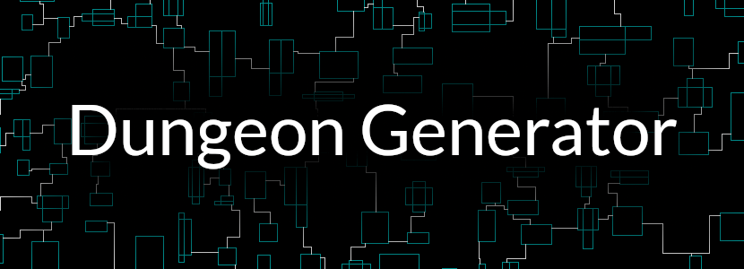
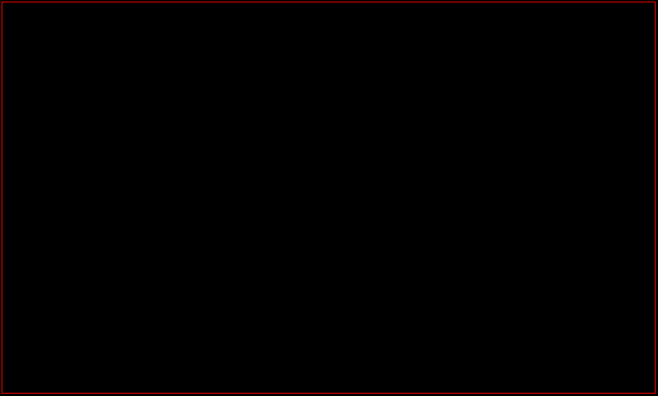
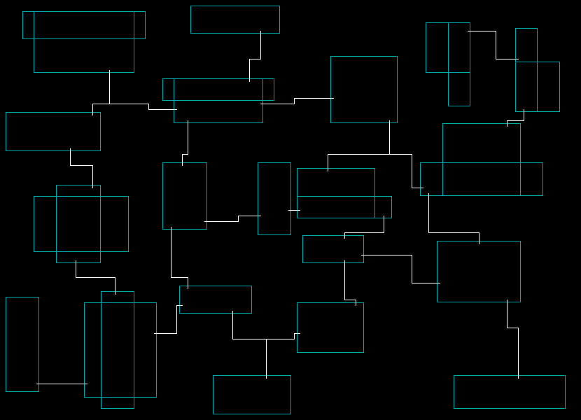
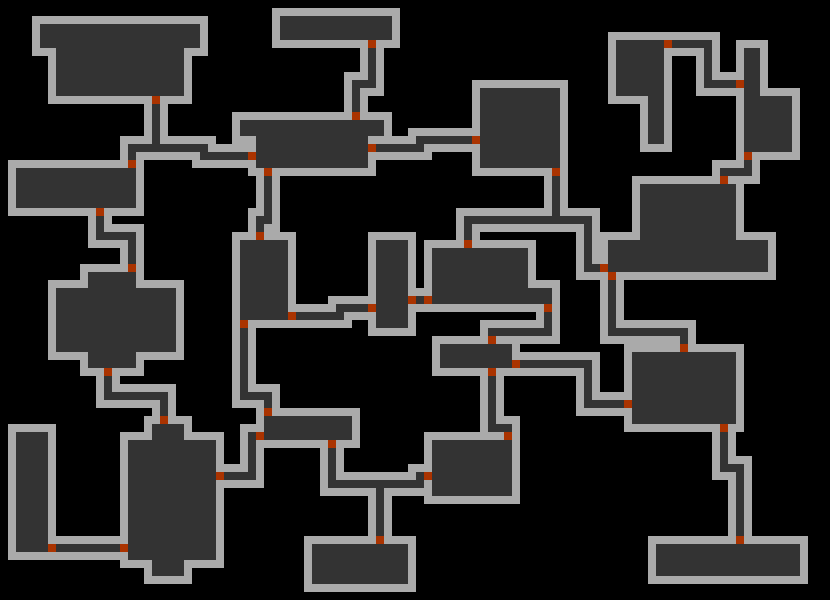

---


### Dungeon-Generator is a free and open-source BSP-based procedural 2D map generator. It was designed with roguelike games in mind, but it is not limited to them.

# :star: Features
* Various settings allow you to precisely customize the appearance of the dungeon.
* It receives a seed value, so the outcome is always predictable.
* A single room can be composed of two rectangular surfaces.
* The algorithm can reduce room density in some areas, thus ensuring output looks more realistic.
* And a lot more!

# :bulb: Example usage
```C++
#include <dgen/dgen.hpp>

int main()
{
    dg::Input input = dg::GetExampleInput();

    // In reality, you should set member variables to your liking
    // and not depend on dg::GetExampleInput(). For example:
    input.m_seed = 42;
    input.m_maxDepth = 7;
    // ...and many more options

    // To generate a dungeon simply write:
    dg::Tilemap tilemap = dg::Generate(&input);

    // That's it! Now you can access data like this:
    dg::Tile tile = tilemap.at(3, 7); // returns the tile at x=3, y=7

    // If you do not want a tilemap, you can generate raw 2D geometry like so:
    dg::Output output{}; // will contain vector data (positions and sizes).
    dg::Generate(&input, &output);

    return 0;
}
```

# :gear: How does it work?

---
Function `dg::Generate()` performs internally several steps:
1. The algorithm recursively divides entire space into smaller cells, keeping the parent-cells
in memory. This method is known as BSP, which produces a binary-tree structure. In
addition, leaf cells create `Tag` objects at the corners of them.
2. In some cells, `Room` objects are placed. Here `Tag` objects are also placed,
but this time, on the room entrance axes, in between cells.
3. Next, `Vertex` objects are created based on `Tag` objects. Multiple tags are
combined into one `Vertex` and all resulting vertices are linked together with
pointers. To do this step, algorithm sorts `Tag` objects beforehand, based on their positions.
4. Previously created BSP-tree is traversed postorder, recursively connecting 
`Room` objects by searching path between them, using A* algorithm.
5. At this point, a special method optimizes `Vertex` objects, based on created paths. This
step is not required, but it helps reduce the size of generated data, without affecting its geometry.
6. Generator produces geometry data, which is optionally converted into a tilemap.

# :mag: What is included in this repository?
Dungeon-Generator project consists of several sub-projects:
* `dgen` - generator library itself. Has no dependencies other than STL.
* `dgen-app` - application that uses the `dgen` library. Depends on **SDL3** and **Dear ImGui**.
* `dgen-benchmark` - micro-benchmarking utility. Measures performance of the `dgen` library.

# :hammer_and_wrench: Building
### Prerequisites:
* Git (only for cloning)
* C++17 compiler
* CMake 3.25 or newer

### Steps:
1. Clone this repository (or download by clicking Code -> Download ZIP).
2. Open a terminal in the project directory.
3. Run the following command:
```bash
cmake -S . -B build && cmake --build build
```

CMake will detect if `Dungeon-Generator` is a top level project.
If so, it will automatically enable `dgen-app` and `dgen-benchmark`. If **SDL3** is not present on the system, it will automatically download it via `FetchContent`. **Dear ImGui** is always downloaded.

# :framed_picture: Images
### Example geometry generated using the `dgen` library:

### After converting it into a tilemap:

